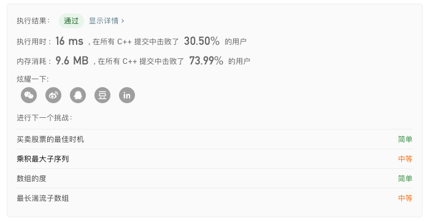
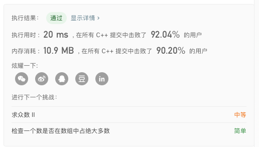
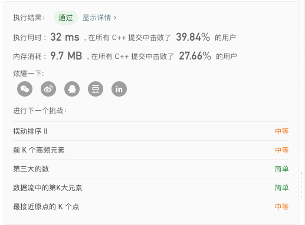
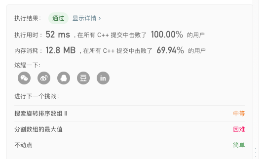
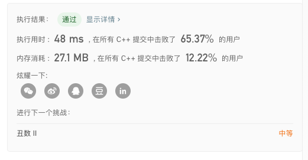
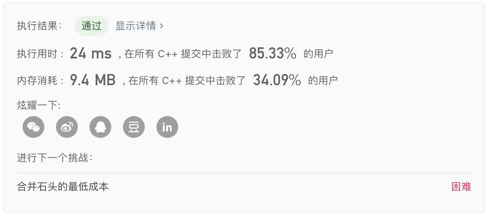

### LeetCode 53. Maximum Subarray

（分治）$$O(nlogn)$$

1. 考虑区间 `[l, r]` 内的答案如何计算，令 `mid = (l + r) / 2`，则该区间的答案由三部分取最大值，分别是：
   (1). 区间 `[l, mid]` 内的答案（递归计算）。
   (2). 区间 `[mid + 1, r]` 内的答案（递归计算）。
   (3). 跨越 `mid`和`mid+1` 的连续子序列。
2. 其中，第(3)部分只需要从 `mid` 开始向` l` 找连续的最大值，以及从 `mid+1` 开始向` r` 找最大值即可，在线性时间内可以完成。
3. 递归终止条件显然是 `l == r` ，此时直接返回` nums[l]`。

#### 时间复杂度

- 每层递归$$O(n)$$，共$$logn$$层，故总的时间复杂度$$O(nlogn)$$。

#### 代码

```c++
class Solution {
public:
    vector<int> nums;
    int dfs(int l, int r)
    {
        if (l == r) return nums[l];
        int mid = (long long)l + r >> 1;
        int lmax = nums[mid], lsum = 0, rmax = nums[mid + 1], rsum = 0;
        for (int i = mid; i >= l; i--) 
        {
            lsum += nums[i];
            lmax = max(lmax, lsum);
        }
        for (int i = mid + 1; i <= r; i++) 
        {
            rsum += nums[i];
            rmax = max(rmax, rsum);
        }
        return max(max(dfs(l, mid), dfs(mid + 1, r)), lmax + rmax);
    }
    int maxSubArray(vector<int>& tmp) {
        nums = tmp;
        return dfs(0, nums.size() - 1);
    }
};
```

#### 结果



### LeetCode 169. Majority Element

（分治）$$O(n)$$

1. 首先将所有元素按相邻两个元素分为一组，如果 n 为奇数，则最后一个元素单独一组，共$$⌈n/2⌉$$
   组。
2. 如果组内两个元素相等，则保留一个；单独一个元素的组直接保留。
3. 不断迭代直到最后只有1个元素，该元素就是主要元素。

#### 时间复杂度

- $$n+n/2+n/4+…+1==O(n)$$

#### 代码

````c++
class Solution {
public:
    int majorityElement(vector<int>& nums) {
        int n = nums.size(), t;
        while (n > 1) 
        {
            t = 0;
            for (int i = 0; i < n; i += 2) 
                if (i == n - 1 || nums[i] == nums[i + 1]) nums[t++] = nums[i];
            n = t;
        }
        return nums[0];
    }
};
````

#### 结果



### LeetCode 215. Kth Largest Element in an Array 

(分治、快速排序) $$ O(n)$$

1. 快速排序算法，在每次划分数组后，判断中轴值 pivot 在划分后的位置。
2. 如果位置正好等于 k ，则直接返回 pivot ;
3. 否则判断是应该进入划分数组的左边还是右边继续寻找第 k 大。

#### 时间复杂度

- 每层递归都是$$O(n)$$，但是每层都走一半。

- 故$$n+n/2+n/4+…+1=O(n)$$

#### 代码

```c++
class Solution {
public:
    int solve(int l, int r, vector<int>& nums, int k) {
        if (l == r)
            return nums[l];
        int pivot = nums[l], i = l, j = r;
        while (i < j) 
        {
            while (i < j && nums[j] < pivot) j--;
            if (i < j)
                nums[i++] = nums[j];

            while (i < j && nums[i] >= pivot) i++;
            if (i < j)
                nums[j--] = nums[i];
        }
        if (i + 1 == k)
            return pivot;
        else if (i + 1 > k)
            return solve(l, i - 1, nums, k);
        else
            return solve(i + 1, r, nums, k);

    }
    int findKthLargest(vector<int>& nums, int k) {
        int n = nums.size();
        return solve(0, n - 1, nums, k);
    }
};
```

#### 结果



### LeetCode 240. Search a 2D Matrix II

(单调性扫描) $$O(n+m)$$

1. 初始化`up = 0, right = n - 1`，从右上角元素开始。
2. 如果发现`matrix[up][right] == target`，则直接返回`true`；
3. 若`matrix[up][right] < target`，则向下移动`up ++`；
4. 否则，向左移动`right--`；
5. 如果出界返回`false`。

#### 时间复杂度

- 每次`up`向下移动或者`right`向左移动，移动次数不超过`n+m`次，故时间复杂度为$$O(n+m)$$。

#### 代码

```c++
class Solution {
public:
    bool searchMatrix(vector<vector<int>>& matrix, int target) {
        int m = matrix.size();
        if (m == 0)
            return false;
        int n = matrix[0].size();

        int up = 0, right = n - 1;
        while (up < m && right >= 0) 
        {
            if (matrix[up][right] == target)
                return true;
            else if (matrix[up][right] < target)
                up++;
            else
                right--;
        }

        return false;
    }
};
```

#### 结果



### LeetCode 23. Merge k Sorted Lists

(二分治合并) $$O(nlogk)$$

1. 将所有待合并的有序单向链表进行递归分治处理，即将当前链表的序列分成两部分.
2. 每部分递归进行合并，然后将当前左右两部分合并的结果再进行合并即可。

#### 时间复杂度

- 递归每层的时间复杂度是整个结点个数$$ O(n)$$，由于每次是二分，所有总共有$$ O(logk)$$层。
- 故总时间复杂度为 $$O(nlogk)$$。

#### 代码

```c++
class Solution {
public:
    ListNode* merge2Lists(ListNode* l1, ListNode* l2) 
    {
        ListNode *head = new ListNode(0);
        ListNode *cur = head;
        while (l1 != NULL && l2 != NULL)
        {
            if (l1 -> val < l2 -> val) 
            {
                cur -> next = l1;
                l1 = l1 -> next;
            }
            else 
            {
                cur -> next = l2;
                l2 = l2 -> next;
            }
            cur = cur -> next;
        }
        cur -> next = (l1 != NULL ? l1 : l2);
        return head -> next;
    }

    ListNode* mergeKLists(vector<ListNode*>& lists) {
        if (lists.size() == 0)
            return NULL;
        if (lists.size() == 1)
            return lists[0];

        int mid = lists.size() / 2;
        vector<ListNode*> left = vector<ListNode*>(lists.begin(), lists.begin() + mid);
        vector<ListNode*> right = vector<ListNode*>(lists.begin() + mid, lists.end());
        ListNode *l1 = mergeKLists(left);
        ListNode *l2 = mergeKLists(right);
        return merge2Lists(l1, l2);
    }
};
```

#### 结果



### LeetCode 312. Burst Balloons

（动态规划）$$O(n^3)$$

1. 状态：`dp[i][j]`表示戳爆从第`i`到第`j`个气球得到的最大金币数。
2. 状态转移方程：$$dp[i][j]=max(dp[i][j],dp[i][k−1]+num[i−1]∗nums[k]∗nums[j+1]+dp[k+1][j])$$

#### 时间复杂度

- 三层循环，故时间复杂度为$$O(n^3)$$。

#### 代码

```c++
class Solution {
public:
    int maxCoins(vector<int>& nums) {
        int n = nums.size();
        nums.insert(nums.begin(), 1); 
        nums.push_back(1);
        vector<vector<int>> dp(n+2, vector<int>(n+2, 0)); 


        for(int len = 1; len <= n; len ++)
        {
            for(int i = 1; i <= n - len + 1; i ++)
            {
                int j = i + len - 1;
                for(int k = i; k <= j; k ++)
                {
                    dp[i][j] = max(dp[i][j], dp[i][k-1] + nums[i-1]*nums[k]*nums[j+1] + dp[k+1][j]);
                }
            }
        }


        return dp[1][n];
    }
};
```

#### 结果



