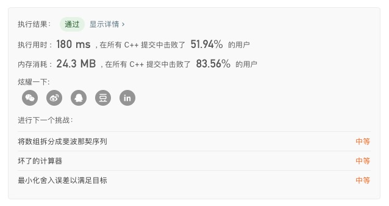
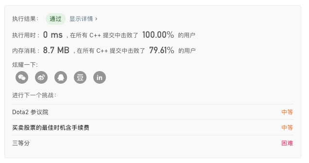

### LeetCode 122. Best Time to Buy and Sell Stock II

（贪心）$$O(n)$$

1. 遍历一次数组，低进高出，把正的价格差相加起来就是最终利润。
2. 可以拆分成以下情况讨论：
   - 递增，如`[1,2,3]`，那么1买3卖与每天都买入卖出等价
   - 递减，如`[3,2,1]`，赚不了的
   - 先高再低，如`[1,3,2]`，只能在1买3卖
   - 先低再高，如`[2,1,3]`，同先高再低
3. 短数组推广到任意数组，故贪心策略是正确的。

#### 时间复杂度

- 扫描数组一遍，时间复杂度为$$O(n)$$。

#### 代码

```c++
class Solution {
public:
    int maxProfit(vector<int>& prices) {
        int sum = 0;
        for(int i = 1; i < prices.size(); i ++)
            if( prices[i] > prices[i - 1]) 
                sum += prices[i] - prices[i - 1];
        return sum;
    }
};
```

#### 结果


### LeetCode 860. Lemonade Change

(贪心) $$O(n)$$

1. 开两个变量记录手中 5 元和 10 元的数量
2. 收到 5 元，增加一张 5 元；
3. 收到 10 元，如果没有 5 元，则返回 false；
4. 收到 20 元，则如果有 10 元的，并且也有至少一张 5 元的，则优先将 10 元配 5 元纸币的找回（因为 5 元的可以更灵活）如果没有 10 元的，但 5 元的有三张，则直接找回三张 5 元的。否则，无法找零，返回 false。

#### 时间复杂度

- 扫描数组一遍，时间复杂度为$$O(n)$$。

#### 代码

```c++
class Solution {
public:
    bool lemonadeChange(vector<int>& bills) {
        int fives = 0, tens = 0;
        for (int i = 0; i < bills.size(); i ++) 
        {
            if (bills[i] == 5) fives++;
            else if (bills[i] == 10) 
            {
                if (fives == 0) return false;
                tens++;
                fives--;
            }
            else 
            {
                if (tens >= 1 && fives >= 1) 
                {
                    tens--;
                    fives--;
                }
                else if (tens == 0 && fives >= 3) fives -= 3;
                else return false;
            }
        }
        return true;
    }
};
```

#### 结果


### LeetCode 455. Assign Cookies

(贪心) $$O(nlogn)$$

1. 将孩子的贪心指数和饼干尺寸从小到大排序。
2. 定义两个指针`i`、`j`，尝试将第` j` 块饼干分配给第 `i`个孩子。若` sj >= gi`，则答案加1，`i`和`j`都向后移动；否则` j`向后移动。

#### 时间复杂度

- 排序时间复杂度$$O(nlogn)$$
- 双指针扫描$$O(n)$$
- 故总的时间复杂度为$$O(nlogn)$$

#### 代码

```c++
class Solution {
public:
    int findContentChildren(vector<int>& g, vector<int>& s) {
        sort(g.begin(), g.end());
        sort(s.begin(), s.end());
        int ans = 0;

        for (int i = 0, j = 0; i < g.size() && j < s.size(); j ++)
            if (s[j] >= g[i]) 
            {
                ans++;
                i++;
            }
        return ans;
    }
};
```

#### 结果


### LeetCode 874. Walking Robot Simulation

（模拟）$$O(n)$$

1. 用`direction`记录机器人移动的方向（正向/负向），用`axis`记录机器人是在`x`还是`y`方向上移动，另外移动时需要判断是否遇到障碍物。
2. 为了迅速判断机器人在移动时是否遇到障碍物，可以将机器人所在位置`(x, y)`放到`set`中，对每一个位置去查询是否在`set`中，这样$$O(1)$$复杂度便可以判断是否遇到障碍物。

#### 时间复杂度

- $$O(n)$$

#### 代码

```c++
class Solution {
public:
    int robotSim(vector<int>& commands, vector<vector<int>>& obstacles) {
        set<pair<int, int>> s;
        for(int i = 0; i < obstacles.size(); i ++)
        {
            int x = obstacles[i][0];
            int y = obstacles[i][1];
            s.insert({x, y});
        }
        int direction = 1;
        int axis = 1;
        int posx = 0;
        int posy = 0;
        int res = 0;
        for(int i = 0; i < commands.size(); i ++)
        {
            if(commands[i] == -1)
            {
                if(axis == 0) direction *= -1;
                axis = (axis + 1) % 2;
            }
            else if (commands[i] == -2)
            {
                if(axis == 1) direction *= -1;
                axis = (axis + 1) % 2;
            }
            else if(commands[i] > 0)
            {
                if(axis == 0)
                {
                    while(commands[i] --)
                    {
                        posx += direction;
                        if(s.find({posx, posy}) != s.end())
                        {
                            posx -= direction;
                            break;
                        }
                    }
                }
                if(axis == 1)
                {
                    while(commands[i] --)
                    {
                        posy += direction;
                        if(s.find({posx, posy}) != s.end())
                        {
                            posy -= direction;
                            break;
                        }
                    }
                }
                int dist = posx * posx + posy * posy;
                if(dist > res) res=dist;
            }
        }
        return res;
    }
};
```

#### 结果



### LeetCode 861. Score After Flipping Matrix

(贪心) $$O(n)$$

1. 尽量使高位变为 `1`，即从高到低位选择，如果高位能变成` 1`，则变成 `1`，不需要考虑对低位的影响。

2. 贪心算法如下，通过行的变换，将所有数字的最高位全部变为 `1`；然后按列枚举，如果这一列中 `1 `的个数比 `0` 少，则进行列变换。

#### 时间复杂度

- 遍历数组常数次，故时间复杂度为 $$O(n)$$。

#### 代码

```c++
class Solution {
public:
    int matrixScore(vector<vector<int>>& A) {
        int n = A.size(), m = A[0].size();
        for (int i = 0; i < n; i ++)
            if (A[i][0] == 0)
                for (int j = 0; j < m; j ++) A[i][j] = 1 - A[i][j];
            
        for (int j = 1; j < m; j ++)
        {
            int cnt = 0;
            for (int i = 0; i < n; i ++) cnt += A[i][j];
            if (cnt <= n / 2)
            		for (int i = 0; i < n; i ++) A[i][j] = 1 - A[i][j];
        }

        int ans = 0;
        for (int i = 0; i < n; i ++)
            for (int j = 0; j < m; j ++)
                ans += A[i][j] << (m - j - 1);
        return ans;
    }
};
```

#### 结果



### LeetCode 392. Is Subsequence

（贪心）$$O(n)$$

1. 访问一遍长字符串的每一位，逐个寻找`s`的每一位。

#### 代码

```c++
class Solution {
public:
    bool isSubsequence(string s, string t) {
        if(s.empty()) return true;
        int m = s.size(), n = t.size();
        for(int i = 0,j = 0; j < n; j++)
        {
          if(s[i] == t[j]) i ++;
          if(i == m) return true;
        }
        return false;
    }
};
```

#### 结果


### LeetCode 134. Gas Station

（贪心）$$O(n)$$

1. 首先用`gas-cost`求出每一段的真正花费`sum`，然后将`sum`数组扩展为`2*n`，使得`sum[i] == sum[i+n]`。
2. 定义两个指针`start`和`end`，分别表示当前假设的起点，和在这个起点下能走到的终点，`cur`为当前油量。
3. 如果发现`cur < 0`，即不能走到`end`时，需要不断往后移动`start`，使得`cur`能满足要求。
4. 如果`end - start + 1 == n`，即找到了一个环形路线。

#### 代码

```c++
class Solution {
public:
    int canCompleteCircuit(vector<int>& gas, vector<int>& cost) {
        int n = gas.size();
        vector<int> sum = vector<int>(n * 2, 0);
        for (int i = 0; i < n * 2; i++)
            sum[i] = gas[i % n] - cost[i % n];

        int start = 0, end = 0, cur = 0;
        while (start < n && end <= 2 * n) 
        {
            cur += sum[end];
            while (cur < 0) {
                cur -= sum[start];
                start++;
            }
            if (end - start + 1 == n)
                return start;
            end++;
        }
        return -1;
    }
};
```

#### 结果

