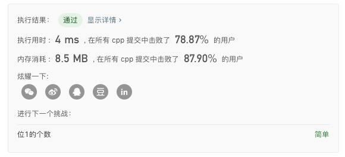
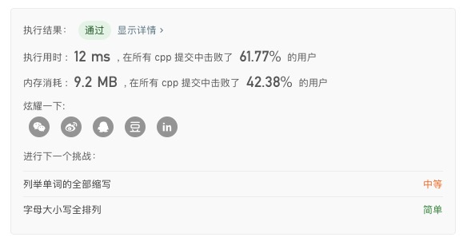
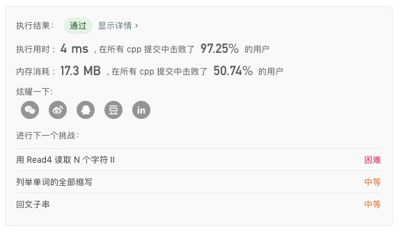
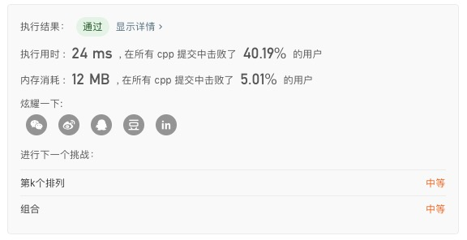
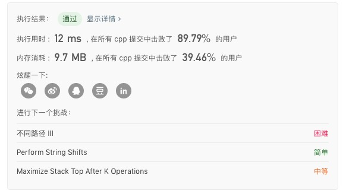

### LeetCode 401. Binary Watch

（暴力）

1.  从`0:00->11:59` 直接判断小时位出现的`1`个数 + 分秒位出现的`1`个数。

#### 代码

```c++
class Solution {
public:
    vector<string> readBinaryWatch(int num) {
        vector<string> res;
        for (int h = 0; h < 12; h++)
        for (int m = 0; m < 60; m++)
        if (bitset<10>(h << 6 | m).count() == num)
            res.push_back(to_string(h) + (m < 10 ? ":0" : ":") + to_string(m));
        return res;
    }
};
```

#### 结果



### LeetCode 78. Subsets

（暴力）$$O(2^n)$$

1. 刚开始`ans`数组中只有空集。
2. 每次将一个元素`x`加入集合：
   - 复制`ans`数组到`tmp`数组。
   - 将`tmp`数组中的每个集合加入`x`。
   - 将`tmp`数组中的所有集合加入`ans`。

#### 代码

```c++
class Solution {
public:
    vector<vector<int>> tmp;
    vector<vector<int>> ans;
    vector<vector<int>> subsets(vector<int>& nums) {
        ans.push_back({});
        int len = nums.size();
        for (int i = 0; i < len; i++)
        {
            tmp = ans;
            for (auto &item : tmp)
            {
                item.push_back(nums[i]);
                ans.push_back(item);
            }
        }
        return ans;
    }
};
```

#### 结果



### LeetCode 22. Generate Parentheses

（暴力）$$O(C_{2n}^{n})$$

1. 深搜。
2. 每次可以放置左括号的条件是当前左括号的数目不超过 n。
3. 每次可以放置右括号的条件是当前右括号的数目不超过左括号的数目。

#### 代码

```c++
class Solution {
public:
    vector<string> res;
    void dfs(int l, int r, int n, string cur) {
        if (l == n && r == n) {
            res.push_back(cur);
            return;
        }
        if (l < n)
            dfs(l + 1, r, n, cur + "(");

        if (r < l)
            dfs(l, r + 1, n, cur + ")");
    }
    vector<string> generateParenthesis(int n) {
        if (n == 0)
            return res;
        dfs(0, 0, n, "");
        return res;
    }
};
```

#### 结果



### LeetCode 46. Permutations

（回溯）$$O(n*n!)$$

1. 从前往后，一位一位枚举，每次选择一个没有被使用过的数。
2. 选好之后，将该数的状态改成“已被使用”，同时将该数记录在相应位置上，然后递归。
3. 递归返回时，不要忘记将该数的状态改成“未被使用”，并将该数从相应位置上删除。

#### 代码

```c++
class Solution {
public:
    int len;
    vector<vector<int>> ans;
    void dfs(vector<int> cur, set<int> buf)
    {
        if (cur.size() == len)
        {
            ans.push_back(cur);
            return;
        }
        for (auto item : buf)
        {
            set<int> tmp = set<int>(buf);
            cur.push_back(item);
            tmp.erase(item);
            dfs(cur, tmp);
            cur.pop_back();
        }
    }
    vector<vector<int>> permute(vector<int>& nums) {
        len = nums.size();
        set<int> num;
        for (auto item : nums)
        {
            num.insert(item);
        }
        vector<int> a;
        dfs(a, num);
        return ans;
    }
};
```

#### 结果



### LeetCode 90. Subsets II

（暴力）$$O(2^n)$$

1. 将输入数组排序，这样相同的元素就会在一起。

2. 刚开始`ans`数组中只有空集。

3. 每次将一个元素`x`加入集合：

   （1）当`x`与前一个元素相同时：

   - 将`tmp`数组中的每个集合加入`x`。
   - 将`tmp`数组中的所有集合加入`ans`。

   （2）当`x`与前一个元素不同时：

   - 复制`ans`数组到`tmp`数组。
   - 将`tmp`数组中的每个集合加入`x`。
   - 将`tmp`数组中的所有集合加入`ans`。

#### 代码

```c++
class Solution {
public:
    vector<vector<int>> ans;
    vector<vector<int>> tmp;
    vector<vector<int>> subsetsWithDup(vector<int>& nums) {
        int len = nums.size();
        sort(nums.begin(), nums.end());
        ans.push_back({});
        for (int i = 0; i < len; i++)
        {
            if (i - 1 >= 0 && nums[i - 1] == nums[i])
            {
                for (auto &item : tmp)
                {
                    item.push_back(nums[i]);
                    ans.push_back(item);
                }
            }
            else
            {
                tmp = ans;
                for (auto &item : tmp)
                {
                    item.push_back(nums[i]);
                    ans.push_back(item);
                }
            }
        }
        return ans;
    }
};
```

#### 结果

